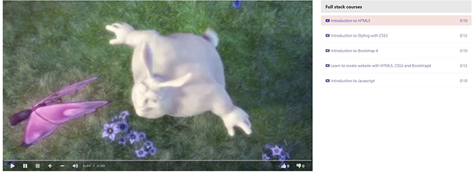
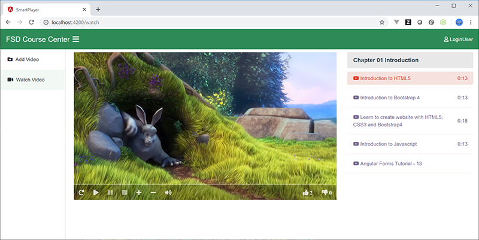

# FSD badge assignments

Try different tech stacks to build a html media player.

Source code: https://github.com/sunmxue/FSD

## Environment
1. Windows10
2. VS Code

## Need to know detail
1. [x] html5/css3
2. [ ] JavaScript es6(https://www.w3schools.com/js/js_window.asp)
3. [ ] angular8(https://angular.io/docs)
4. [ ] jQuery(https://www.w3schools.com/jquery/default.asp)
5. [ ] react(https://www.w3schools.com/react/default.asp)
6. [ ] vue2
7. [ ] spring boot
